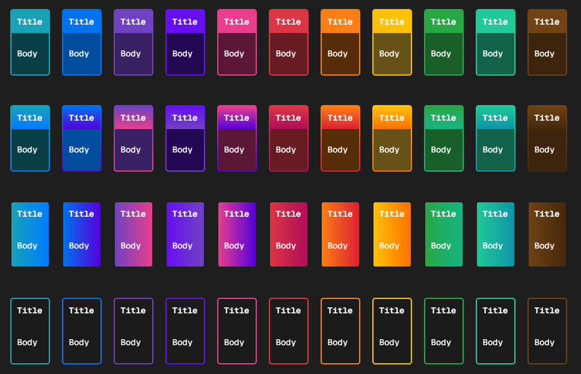

# Meu Vault

Um plugin para Obsidian que traz organização visual ao seu vault através de callouts personalizados e pastas coloridas dinâmicas.

---

## Funcionalidades

### Callouts Window Box

Um conjunto rico de cards de callout com controle total de cor e estilo. Os cards podem ser dispostos lado a lado usando o container `flex-box` e suportam quatro variantes visuais:

| Variante | Descrição |
|---|---|
| *(padrão)* | Fundo sólido com borda na mesma cor |
| `grad` | Fundo em gradiente da cor até seu complementar |
| `transparent` | Card estilo glass com apenas a borda colorida |
| `grad transparent` | Gradiente horizontal aplicado sobre fundo transparente |

**Cores disponíveis:** `cyan` `blue` `purple` `indigo` `pink` `red` `orange` `yellow` `green` `teal` `sepia` `black` `white`



#### Uso básico

```md
> [!window-box|blue] Título
> Conteúdo aqui
```

#### Lado a lado com flex-box

```md
> [!flex-box]
>> [!window-box|cyan] Card 1
>> Corpo
>
>> [!window-box|purple] Card 2
>> Corpo
>
>> [!window-box|green] Card 3
>> Corpo
```

#### Variante gradiente

```md
> [!window-box|blue grad] Título
> Corpo
```

#### Transparente com gradiente horizontal

```md
> [!window-box|orange grad transparent horizontal] Título
> Corpo
```

---

### Pastas Coloridas

Colore automaticamente as pastas no explorador de arquivos com base no prefixo do nome. Dois modos estão disponíveis e podem ser alternados a qualquer momento nas configurações do plugin:

- **Enhanced** — modo padrão, fundos coloridos limpos por pasta
- **Legacy** — paleta de cores alternativa para quem preferir

Ambos os modos são totalmente personalizáveis: é possível adicionar, remover, reordenar e alterar a cor de qualquer entrada diretamente no painel de configurações.

#### Painel de configurações

- Alternar entre os modos **Enhanced** e **Legacy**
- Cada entrada exibe a cor atual, com um dropdown para escolher da paleta completa ou um color picker para cor personalizada
- Reordenar entradas com os botões ↑ ↓
- Editar o prefixo da pasta inline com o botão ✏️
- Remover qualquer entrada com o botão 🗑️
- Adicionar novas entradas com o botão **+**

---

### Status Themes

O plugin monitora o frontmatter das suas notas em busca de qualquer propriedade que comece com `status`. Quando um nome de tema reconhecido é encontrado, ele é adicionado automaticamente ao `cssclasses` da nota — aplicando o tema visual correspondente no Obsidian. A classe é removida automaticamente quando o status deixa de corresponder.

Essa feature está em progreso, a parte de adicionar o cssclasses já está funcionando, mas os temas em si ainda não foram implementados.

---

## Instalação

### Manual

1. Acesse a página de [Releases](../../releases) e baixe os arquivos da versão mais recente:
   - `main.js`
   - `styles.css`
   - `manifest.json`

2. No seu vault, abra a pasta de plugins:
   ```
   <seu-vault>/.obsidian/plugins/
   ```

3. Crie uma nova pasta chamada `meu-vault` e coloque os três arquivos baixados dentro dela:
   ```
   .obsidian/plugins/meu-vault/
   ├── main.js
   ├── styles.css
   └── manifest.json
   ```

4. No Obsidian, vá em **Configurações → Plugins da comunidade**, encontre **Meu Vault** na lista e ative-o.

> Caso a pasta de plugins não exista, certifique-se de que o **Modo seguro** está desativado em **Configurações → Plugins da comunidade**.

---

## Requisitos

- Obsidian **v1.0.0** ou superior

---

## Licença

MIT