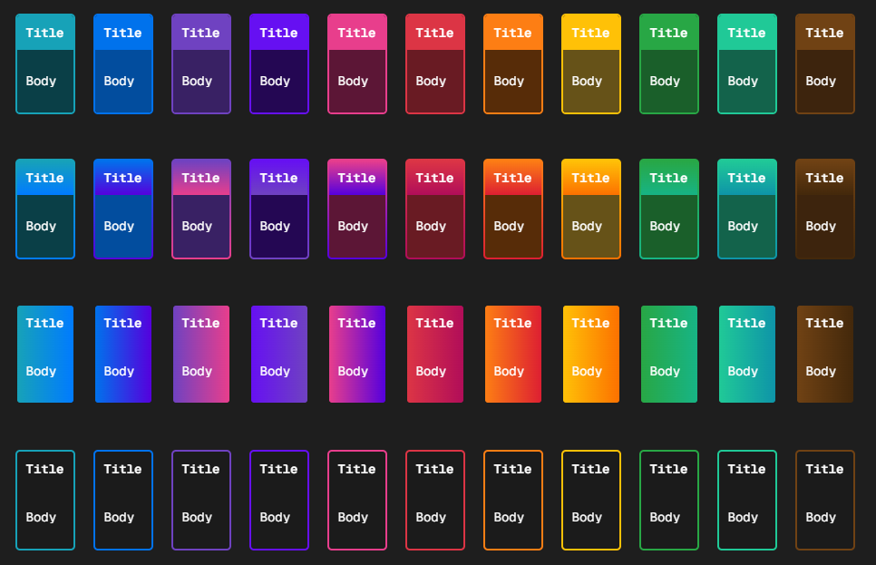
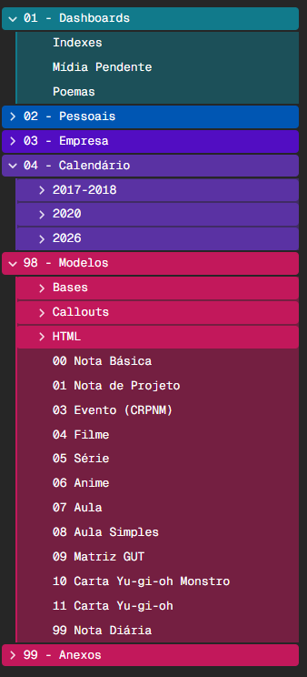
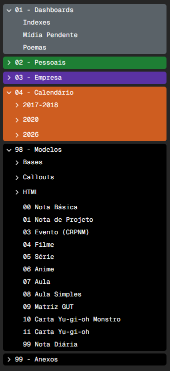
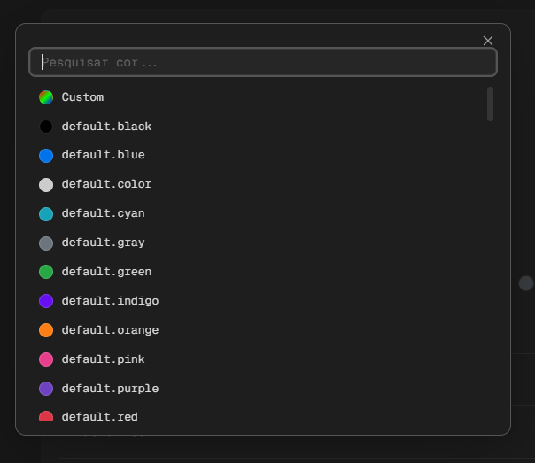
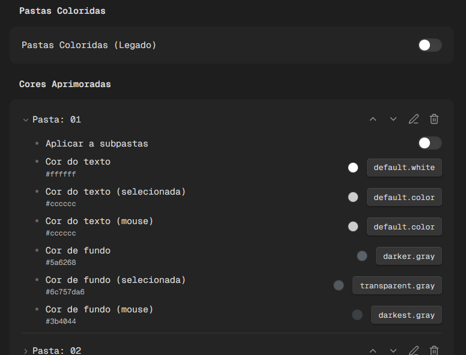

# Meu Vault

Um plugin para Obsidian que traz organização visual ao seu vault através de callouts personalizados e pastas coloridas dinâmicas.

---

## Funcionalidades

### Callouts Window Box

Um conjunto rico de cards de callout com controle total de cor e estilo. Os cards podem ser dispostos lado a lado usando o container `flex-box` e suportam quatro variantes visuais:

| Variante | Descrição |
|---|---|
| *(padrão)* | Fundo sólido com borda na mesma cor |
| `grad` | Fundo em gradiente da cor até seu complementar |
| `transparent` | Card estilo glass com apenas a borda colorida |
| `grad transparent` | Gradiente horizontal aplicado sobre fundo transparente |

**Cores disponíveis:** `cyan` `blue` `purple` `indigo` `pink` `red` `orange` `yellow` `green` `teal` `sepia` `black` `white`



#### Uso básico

```md
> [!window-box|blue] Título
> Conteúdo aqui
```

#### Lado a lado com flex-box

```md
> [!flex-box]
>> [!window-box|cyan] Card 1
>> Corpo
>
>> [!window-box|purple] Card 2
>> Corpo
>
>> [!window-box|green] Card 3
>> Corpo
```

#### Variante gradiente

```md
> [!window-box|blue grad] Título
> Corpo
```

#### Transparente com gradiente horizontal

```md
> [!window-box|orange grad transparent horizontal] Título
> Corpo
```

---

### Pastas Coloridas

Colore automaticamente as pastas no explorador de arquivos com base no prefixo do nome. Dois modos estão disponíveis e podem ser alternados a qualquer momento nas configurações do plugin:

- **Enhanced** — modo padrão, fundos coloridos limpos por pasta
- **Legacy** — paleta de cores alternativa para quem preferir

Ambos os modos são totalmente personalizáveis: é possível adicionar, remover, reordenar e alterar a cor de qualquer entrada diretamente no painel de configurações.

---

### Customização Avançada de Pastas

O plugin oferece uma interface nativa e rica dentro das configurações do Obsidian para que você tenha controle absoluto sobre a identidade visual do seu explorador de arquivos.

#### Estilos Visuais Disponíveis

**Modo Legado:**



**Modo Aprimorado (Enhanced):**



#### Recursos do Painel de Configurações

* **Controle de Estados Granular:** Defina cores independentes para o texto e fundo da pasta em três estados diferentes: padrão, selecionada e ao passar o mouse (`mouse`).
* **Herança Dinâmica:** Opção para alternar o comportamento de *Aplicar a subpastas* com apenas um clique.
* **Seletor de Cores Inteligente:** Um modal dedicado com busca integrada para selecionar rapidamente entre as cores predefinidas do sistema ou definir uma cor totalmente customizada (`Custom`).



* **Gerenciamento Ágil:**
  * Alterne facilmente entre os modos **Enhanced** e **Legacy**.
  * Reordene a prioridade das regras de prefixo usando as setas ↑ ↓.
  * Edite os prefixos diretamente na linha (*inline*) com o botão ✏️.
  * Remova ou adicione regras instantaneamente com os botões 🗑️ e **+**.



---

### Texto Colorido

O plugin estende a estilização do Obsidian permitindo aplicar cores e efeitos diretamente no corpo do texto através da classe `colored-text`.

| Variante | Descrição |
|---|---|
| `bold` | Aplica o efeito de negrito ao texto |
| `italic` | Aplica o efeito de itálico ao texto |
| `underline` | Adiciona uma linha inferior (sublinhado) |
| `strikethrough` | Adiciona uma linha sobre o texto (tachado) |
| `grad` | Aplica um gradiente vertical da cor escolhida até seu tom complementar |
| `horizontal` | Modifica o gradiente para a orientação horizontal (deve ser usado junto com `grad`) |
| `highlight-[cor]` | Destaca o fundo do texto com a cor especificada (ex: `highlight-cyan`) |

**Cores disponíveis:** `cyan` `blue` `purple` `indigo` `pink` `red` `orange` `yellow` `green` `teal` `sepia` `black` `white`

#### Exemplos de Uso

```md
<!-- Uso simples de cor -->
O <span class="colored-text cyan">texto em ciano</span> destaca termos importantes.

<!-- Combinação de estilo e gradiente horizontal -->
Um exemplo de <span class="colored-text orange bold grad horizontal">gradiente horizontal em negrito</span>.

<!-- Efeitos de formatação e destaque de fundo -->
Podemos usar <span class="colored-text red bold strikethrough">texto tachado</span> ou um <span class="colored-text highlight-yellow">marca-texto amarelo</span> para revisão.
```

---

### Status Themes

O plugin monitora o frontmatter das suas notas em busca de qualquer propriedade que comece com `status`. Quando um nome de tema reconhecido é encontrado, ele é adicionado automaticamente ao `cssclasses` da nota — aplicando o tema visual correspondente no Obsidian. A classe é removida de forma dinâmica assim que o status deixa de corresponder.

> ⚠️ **Nota:** Esta funcionalidade está em desenvolvimento. A injeção automática de classes no `cssclasses` já está totalmente operacional, mas os temas visuais específicos serão implementados nas próximas versões.

---

## Instalação

### Manual

1. Acesse a página de [Releases](https://github.com/MarcosMiraco/meu-vault/releases) e baixe os arquivos da versão mais recente:
   - `main.js`
   - `styles.css`
   - `manifest.json`

2. No seu vault, abra a pasta de plugins:
   ```
   <seu-vault>/.obsidian/plugins/
   ```

3. Crie uma nova pasta chamada `meu-vault` e coloque os três arquivos baixados dentro dela:
   ```
   .obsidian/plugins/meu-vault/
   ├── main.js
   ├── styles.css
   └── manifest.json
   ```

4. No Obsidian, vá em **Configurações → Plugins da comunidade**, encontre **Meu Vault** na lista e ative-o.

> Caso a pasta de plugins não exista, certifique-se de que o **Modo seguro** está desativado em **Configurações → Plugins da comunidade**.

---

## Requisitos

- Obsidian **v1.0.0** ou superior

---

## Licença

MIT